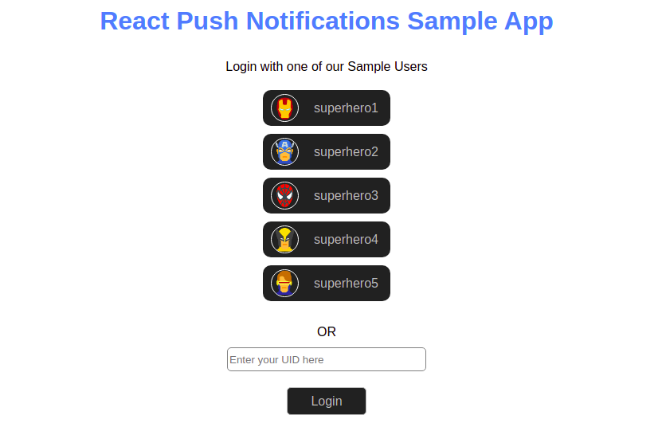

# Token-based Push Notifications Sample App

This Sample app will guide you to setup Push Notifications in your ReactJS web application.

## Pre-requisite
1. Login to the <a href="https://app.cometchat.io/" target="_blank">CometChat Dashboard</a>.
2. Select an existing app or create a new one.
3. Go to "API & Auth Keys" section and copy the `REST API` key from the "REST API Keys" tab.
4. Go to the "Extensions" section and Enable the Push Notifications extension.
5. Go to the "Installed" tab in the same section and open the settings for this extension and Set the version to `V2`.
6. Also, save the `REST API` key in the Settings and click on Save.
7. Copy the `APP_ID`, `REGION` and `AUTH_KEY` for your app.

## Usage

1. Clone this repository.
2. Navigate to the root directory and replace `APP_ID`, `REGION` and `AUTH_KEY` with yours in `src/consts.js` file.
3. Install dependencies using `npm install`.
4. Get the `FIREBASE_CONFIG` object for your Firebase App from the <a href="https://console.firebase.com/" target="_blank">Firebase Console</a>.
5. Paste the object in `src/firebase.js` and `public/firebase-messaging-sw.js`.
6. Run the app using `npm start`.
7. Open the app in 2 different browsers and login using 2 different users.
8. Send the browser tab to the background.
9. Send a message to the user logged in to it from the other browser.
10. You should be able to see the notification since the other tab is not in focus.

---

## Documentation

<a href="https://prodocs.cometchat.com/docs/extensions-enhanced-push-notification" target="_blank">Token-based Push Notifications</a>